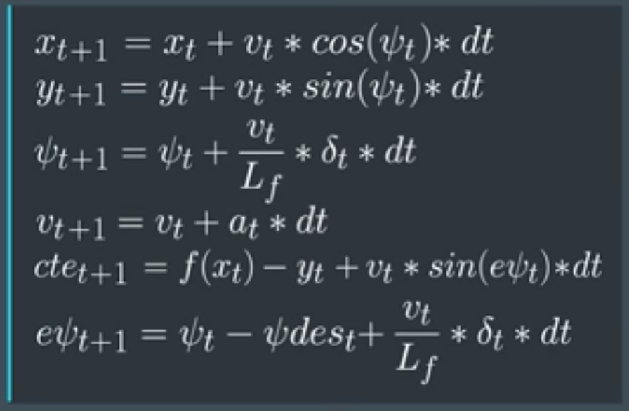

# Self-Driving Car Engineer Nanodegree
## P10: Model Predictive Control Project

By Greg Yeutter

2017-09-20

## 1. Description of Model

This project is based on the bicycle model, a simplified kinematic model. The following parameters completely describe the vehicle's state:

| Parameter | Description |
| --------- | ----------- |
| px       | *x* position of vehicle |
| py       | *y* position of vehicle |
| psi       | orientation of vehicle  |
| v         | velocity                |
| cte       | cross-track error       |
| epsi      | error in vehicle orientation |

In this project, two actuators are used to modulate the state:

| Parameter | Description |
| --------- | ----------- |
| Throttle  | Change in forward velocity, from brake (-1) to max acceleration (+1) |
| Steering Angle | Direction of steering, from left (-25&deg;) to right (+25&deg;) |

The following equations will update the state of the model:



The following is the cost function of the model:


## 2. Rationale for Timestamp Length and Duration Between Timestamps

The values for timestamp length (N) and elapsed duration between timestamps (dt) were:

```python
size_t N = 25;
double dt = 0.05;
```

While these values match the solution from the MPC quiz, I did adjust them in my implementation. I thought that matching dt to the latency (dt = 0.1, latency = 100 ms) would be a logical choice, but it proved harder to tune parameters at dt = 0.1. Parameter tuning was more straightforward at dt = 0.05, or twice as many timestamps as the latency.  I suspect this is due to a finer resolution in the calculation update.

I kept N = 25 because performance was acceptable on my computer (Macbook Pro Early 2015, 2.7 GHz Intel Core i5, 8 GB DDR3, MacOS 10.12.6), even with other programs running in the background. The simulation performance could be improved by picking a lower value of N, because a larger N requires more computational time.

A smaller time horizon (N * dt) allows the car to go faster, because the vehicle covers more distance in the same amount of time as a slower vehicle.

## 3. Description of Waypoint Processing

In my implementation, waypoints are preprocessed to simplify the polynomial fit. The following transformation causes the vehicle x, y coordinates to be centered at the origin (0, 0), with the orientation, psi, also at zero.

```python
// Calculate the number of waypoints in the x and y directions
auto num_wp = ptsx.size();
Eigen::VectorXd wp_x(num_wp);
Eigen::VectorXd wp_y(num_wp);
for (int i = 0; i < num_wp; i++) {
    // Shift 90 degrees
    double dx = ptsx[i] - px;
    double dy = ptsy[i] - py;
    wp_x[i] = dx * cos(-psi) - dy * sin(-psi);
    wp_y[i] = dx * sin(-psi) + dy * cos(-psi);
}
```

Other values (cte, v, and epsi) were just initialized to zero before the MPC procedure.

Model Predictive Control (represented by the green line) outputs were calculated as a third-degree polynomial.

```python
AD<double> f0 = coeffs[0] + coeffs[1] * x0 + coeffs[2] * x0 * x0 + coeffs[3] * x0 * x0 * x0;
AD<double> psides0 = CppAD::atan(coeffs[1] + 2 * coeffs[2] * x0 + 3 * coeffs[3] * x0 * x0);
```

## 4. Handling of Latency

I based my model on an update latency of 100 ms. To do this successfully, I factored in the latency when calculating px, py, psi, and v:

```python
// Factor in 100ms latency
double latency = 0.1;
psi -= latency * v * steer_value / Lf;
px += latency * v * cos(psi);
py += latency * v * sin(psi);
v += latency * throttle_value;
```

The result is that the position, orientation, and velocity are computed 100 ms in the future. 

## 5. Parameter Tuning

Parameter tuning was relatively straightforward with a latency of 100 ms, dt = 0.05, and N = 25. I only had to emphasize the actuator inputs, but multiplying them each by 100. Tuning of cte, epsi, v, and actuations with latency factored in was unneccesary. 

```python
// The part of the cost based on the reference state.
for (int t = 0; t < N; t++) {
    fg[0] += 1 * CppAD::pow(vars[cte_start + t], 2);
    fg[0] += 1 * CppAD::pow(vars[epsi_start + t], 2);
    fg[0] += CppAD::pow(vars[v_start + t] - ref_v, 2);
}

// Minimize the use of actuators.
for (int t = 0; t < N - 1; t++) {
    fg[0] += 100 * CppAD::pow(vars[delta_start + t], 2);
    fg[0] += 100 * CppAD::pow(vars[a_start + t], 2);
}

// Minimize the value gap between sequential actuations.
for (int t = 0; t < N - 2; t++) {
    fg[0] += 1 * CppAD::pow(vars[delta_start + t + 1] - vars[delta_start + t], 2);
    fg[0] += 1 * CppAD::pow(vars[a_start + t + 1] - vars[a_start + t], 2);
}
```